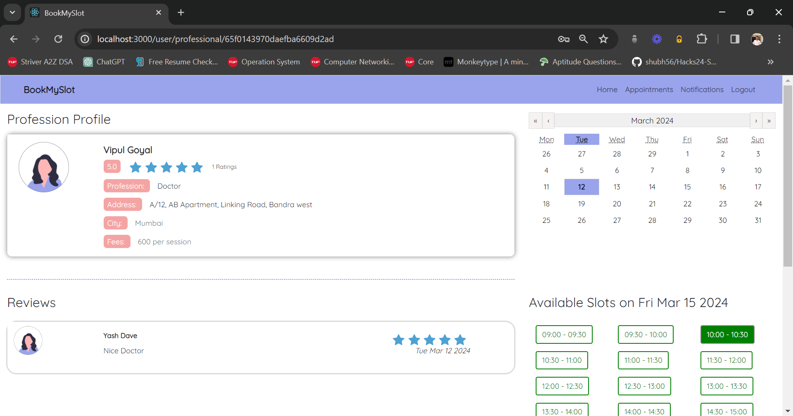
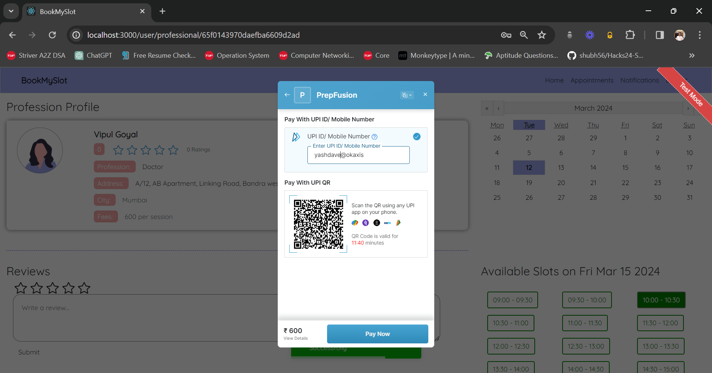
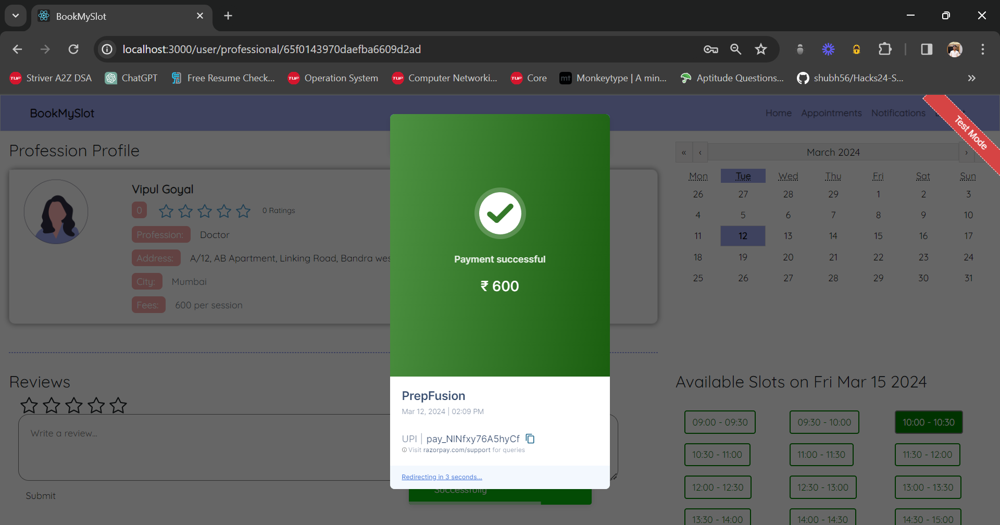
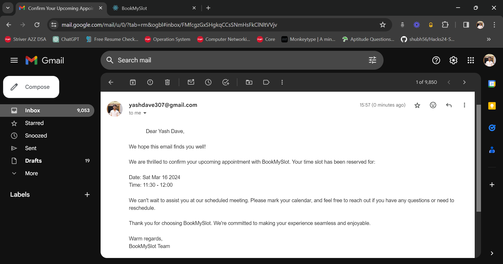
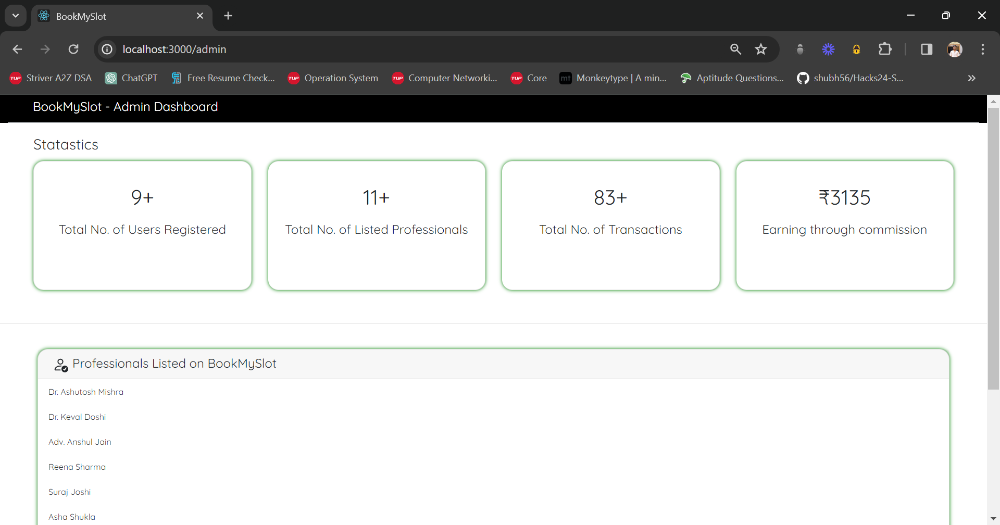

 

  
     

 

 

### Table of Content

- [Table of Content](#table-of-content)
- [Features](#features)
- [Demonstration](#demonstration)
- [Technologies Used](#technologies)
- [Author](#author)

 

### Features

- Login with Google.
- search option and filters based on ratings, location, profession.
- In app notifications.
- Costumer Reviews.
- Date and Time slot selection.
- Razorpay payment integration.
- Cancel appointment (for end users)
- Mail notifications of the booking.
- SMS notifications of the booking.
- Filter appointments date wise. (For professionals)
- Finance Dashboard. (Payment history + earning details)
- Admin Dashboard (BookMySlot company)

 

### Demonstration

**Landing Page**

  

**User Register & Login**
 

<table>
    <tr>
        <td>
            
        </td>
        <td>
            
        </td>
    </tr>
</table>

**User Home Page**
 

  

**Booking Appointment**
 

  
  

**Payment**
 

<table>
    <tr>
        <td>
            
        </td>
        <td>
            
        </td>
    </tr>
</table>

**Mail Notification**
 

  

**Appointments Page and Cancel Appointment Feature**
 

  

**Professional Register and Login**
 

<table>
    <tr>
        <td>
            
        </td>
        <td>
            
        </td>
    </tr>
</table>

**Professional's Dashboard**
 

  

**Professional's Finance Page**
 

  

**BookMySlot Company's Finance**
 

  

 

### Technologies Used

 

- Workflow and Architecture Design
  - Excalidraw
- Prototyping and Frontend Design
  - Figma
- Frontend
  - React.js
  - CSS
- Backend
  - Node.js (Express.js)
  - MongoDB

 

**Dependencies**

- react-calendar
- react-toastify
- nodemailer
- twilio
- razorpay
- express-validator

 
 

### Author

- Asmi Gawade
  - [LinkedIn](https://www.linkedin.com/in/asmi-gawade-431a96262/)
- Basavraj Dhamange
  - [LinkedIn](https://www.linkedin.com/in/basavraj-dhamanage-493920262/)
- Vaishnavi Hindalekar
  - [LinkedIn](https://www.linkedin.com/in/vaishnavi-hindalekar-37747b259/)
- Yash Dave
  - [LinkedIn](https://www.linkedin.com/in/yashdave7/)
